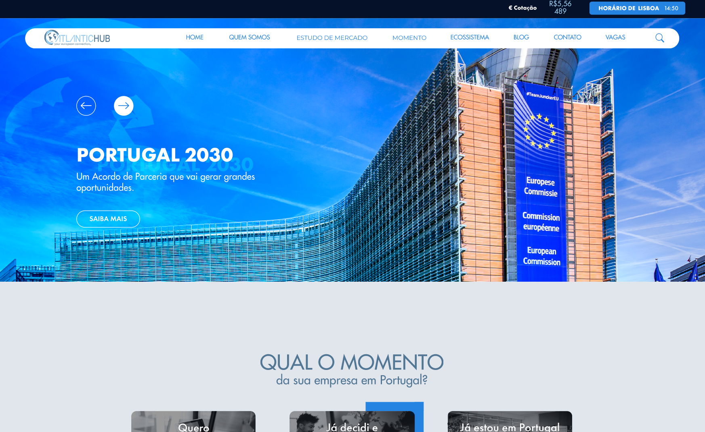

<!-- TITLE -->
<h1 align="center" color="black"><a href="" target="_blank">Atlantic Hub</a></h1>

<!-- THUMB -->

  

<!-- STATUS -->

---

<!-- DESCRIPTION -->

 
        💡 
        Reconstrução completa de site. Projeto interno Wordpress.
    

<!-- INTRO -->

## Índice

-   [Tecnologias](#tecnologies)
-   [Objetivo](#goal)
-   [Funcionalidades](#features)
-   [Requerimentos de qualidade](#quality)
-   [Instruções de Uso](#glossary)
-   [Autor](#authors)

## Tecnologias 

- PHP
- Js
- Sass
- AOS (Animações)
- Bootstrap

## Objetivo 

 A proposta é remodelar o site antigo do cliente, criando uma plataforma visualmente atraente e bem estruturada. O objetivo é proporcionar uma experiência moderna para os usuários, mantendo as funcionalidades essenciais. O novo design refletirá a identidade da marca, atraindo mais visitantes e aumentando o engajamento.

## Requisitos 

- Plataforma Wordpress
- Migração de Posts

## Requerimentos de qualidade 

- Responsividade
- Performance
- Sustentável

## Autor 

-   [@Gabriel Assunção](https://github.com/zDeep10) - Ideia e Construção
